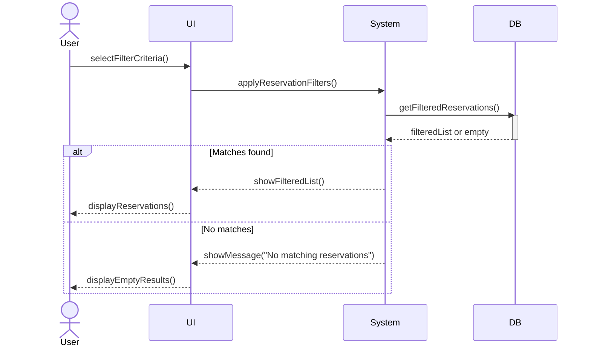

```mermaid
sequenceDiagram
    actor User
    participant UI
    participant System
    participant DB

    User->>UI: selectFilterCriteria()
    UI->>System: applyReservationFilters()
    System->>DB: getFilteredReservations()
    activate DB
    DB-->>System: filteredList or empty
    deactivate DB

    alt Matches found
        System-->>UI: showFilteredList()
        UI-->>User: displayReservations()
    else No matches
        System-->>UI: showMessage("No matching reservations")
        UI-->>User: displayEmptyResults()
    end
```
