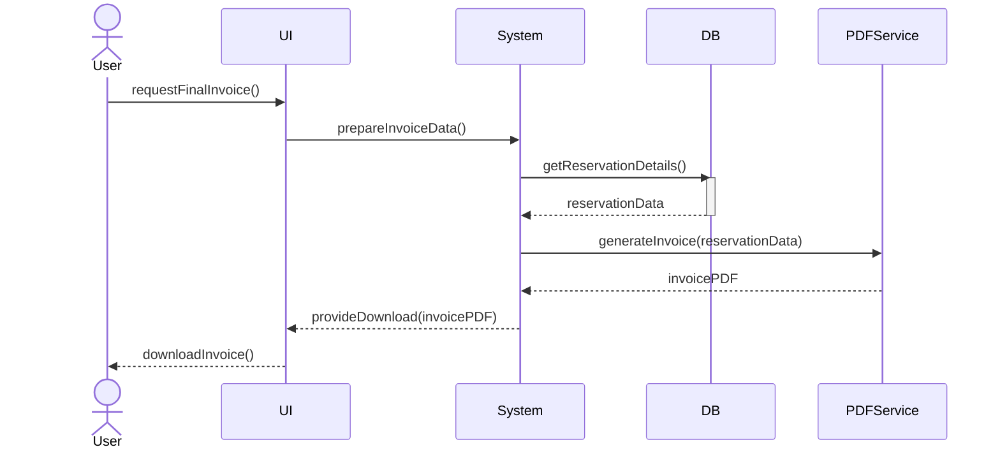

```mermaid
sequenceDiagram
    actor User
    participant UI
    participant System
    participant DB
    participant PDFService

    User->>UI: requestFinalInvoice()
    UI->>System: prepareInvoiceData()
    System->>DB: getReservationDetails()
    activate DB
    DB-->>System: reservationData
    deactivate DB

    System->>PDFService: generateInvoice(reservationData)
    PDFService-->>System: invoicePDF
    System-->>UI: provideDownload(invoicePDF)
    UI-->>User: downloadInvoice()
```
