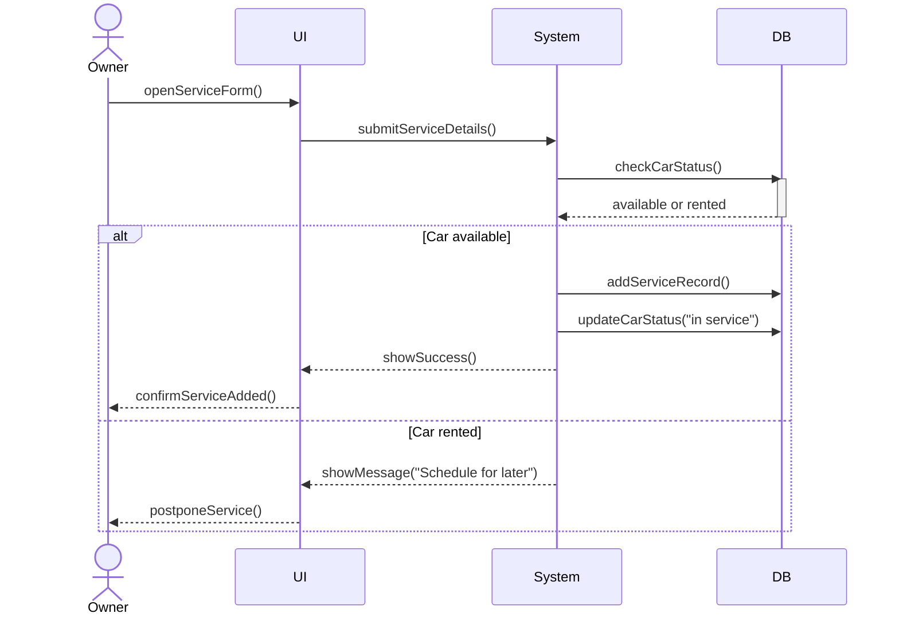

```mermaid
sequenceDiagram
    actor Owner
    participant UI
    participant System
    participant DB

    Owner->>UI: openServiceForm()
    UI->>System: submitServiceDetails()
    System->>DB: checkCarStatus()
    activate DB
    DB-->>System: available or rented
    deactivate DB

    alt Car available
        System->>DB: addServiceRecord()
        System->>DB: updateCarStatus("in service")
        System-->>UI: showSuccess()
        UI-->>Owner: confirmServiceAdded()
    else Car rented
        System-->>UI: showMessage("Schedule for later")
        UI-->>Owner: postponeService()
    end
```
