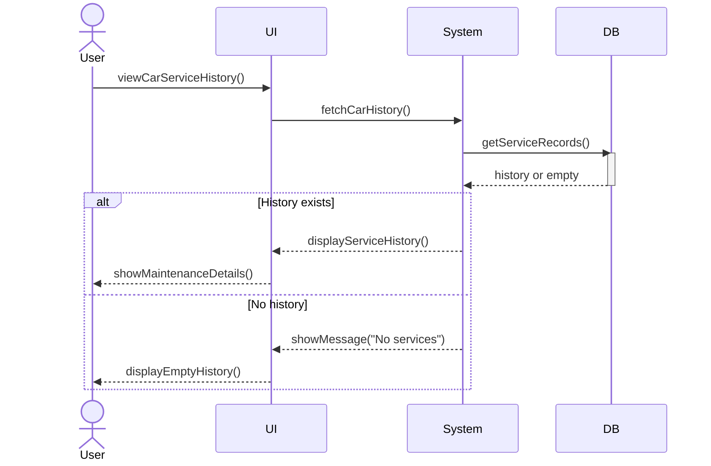

```mermaid
sequenceDiagram
    actor User
    participant UI
    participant System
    participant DB

    User->>UI: viewCarServiceHistory()
    UI->>System: fetchCarHistory()
    System->>DB: getServiceRecords()
    activate DB
    DB-->>System: history or empty
    deactivate DB

    alt History exists
        System-->>UI: displayServiceHistory()
        UI-->>User: showMaintenanceDetails()
    else No history
        System-->>UI: showMessage("No services")
        UI-->>User: displayEmptyHistory()
    end
```
