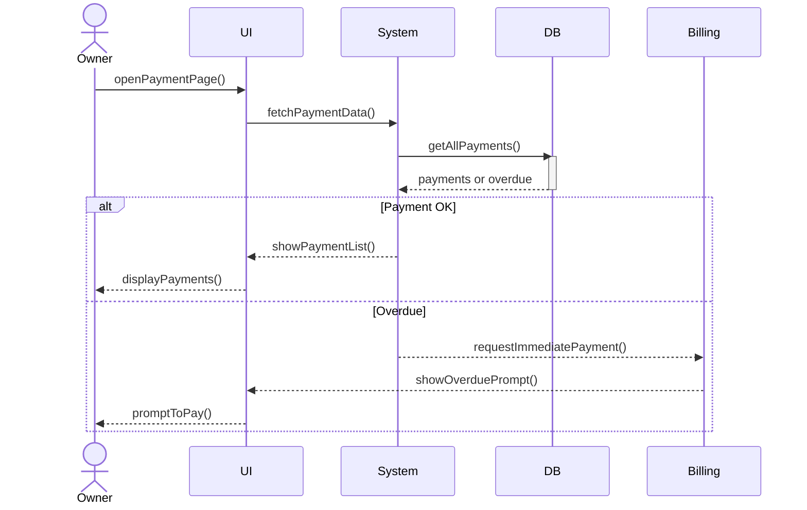

```mermaid
sequenceDiagram
    actor Owner
    participant UI
    participant System
    participant DB
    participant Billing

    Owner->>UI: openPaymentPage()
    UI->>System: fetchPaymentData()
    System->>DB: getAllPayments()
    activate DB
    DB-->>System: payments or overdue
    deactivate DB

    alt Payment OK
        System-->>UI: showPaymentList()
        UI-->>Owner: displayPayments()
    else Overdue
        System-->>Billing: requestImmediatePayment()
        Billing-->>UI: showOverduePrompt()
        UI-->>Owner: promptToPay()
    end
```
