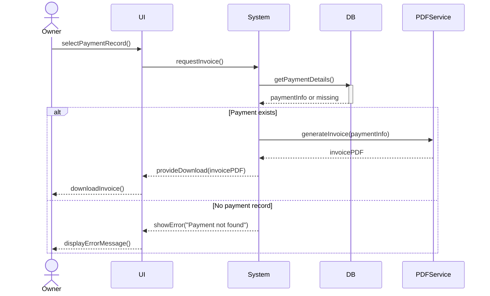

```mermaid
sequenceDiagram
    actor Owner
    participant UI
    participant System
    participant DB
    participant PDFService

    Owner->>UI: selectPaymentRecord()
    UI->>System: requestInvoice()
    System->>DB: getPaymentDetails()
    activate DB
    DB-->>System: paymentInfo or missing
    deactivate DB

    alt Payment exists
        System->>PDFService: generateInvoice(paymentInfo)
        PDFService-->>System: invoicePDF
        System-->>UI: provideDownload(invoicePDF)
        UI-->>Owner: downloadInvoice()
    else No payment record
        System-->>UI: showError("Payment not found")
        UI-->>Owner: displayErrorMessage()
    end
```
