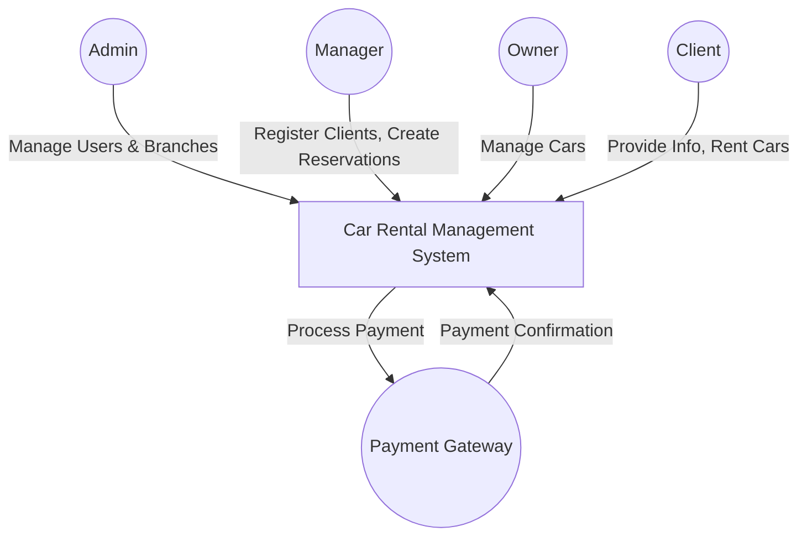

```mermaid
graph TD
    Admin((Admin))
    Manager((Manager))
    Owner((Owner))
    Client((Client))
    PaymentGateway((Payment Gateway))
    System[Car Rental Management System]

    Admin -->|Manage Users & Branches| System
    Manager -->|Register Clients, Create Reservations| System
    Owner -->|Manage Cars| System
    Client -->|Provide Info, Rent Cars| System
    System -->|Process Payment| PaymentGateway
    PaymentGateway -->|Payment Confirmation| System
```
