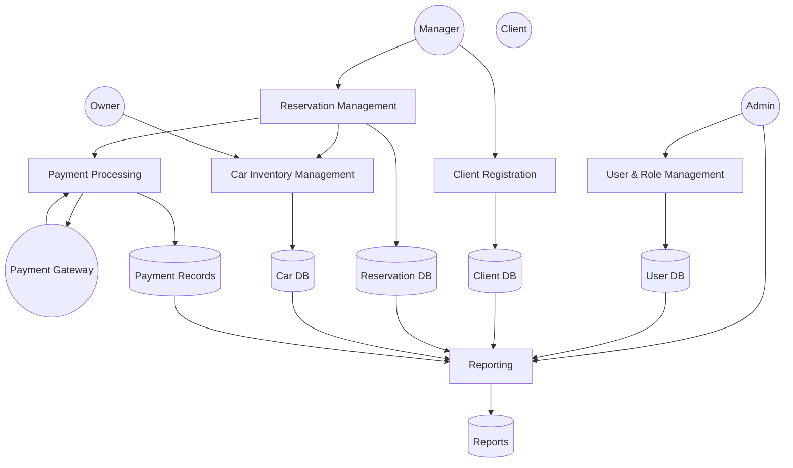

```mermaid
graph TD
    %% External Entities
    Admin((Admin))
    Manager((Manager))
    Owner((Owner))
    Client((Client))
    PaymentGateway((Payment Gateway))

    %% Processes
    P1[User & Role Management]
    P2[Client Registration]
    P3[Reservation Management]
    P4[Car Inventory Management]
    P5[Payment Processing]
    P6[Reporting]

    %% Data Stores
    DS1[(User DB)]
    DS2[(Client DB)]
    DS3[(Reservation DB)]
    DS4[(Car DB)]
    DS5[(Payment Records)]
    DS6[(Reports)]

    %% Flows
    Admin --> P1
    P1 --> DS1

    Manager --> P2
    P2 --> DS2

    Manager --> P3
    P3 --> DS3
    P3 --> P4
    P4 --> DS4
    Owner --> P4

    P3 --> P5
    P5 --> PaymentGateway
    PaymentGateway --> P5
    P5 --> DS5

    Admin --> P6
    P6 --> DS6
    DS1 --> P6
    DS2 --> P6
    DS3 --> P6
    DS4 --> P6
    DS5 --> P6
```
