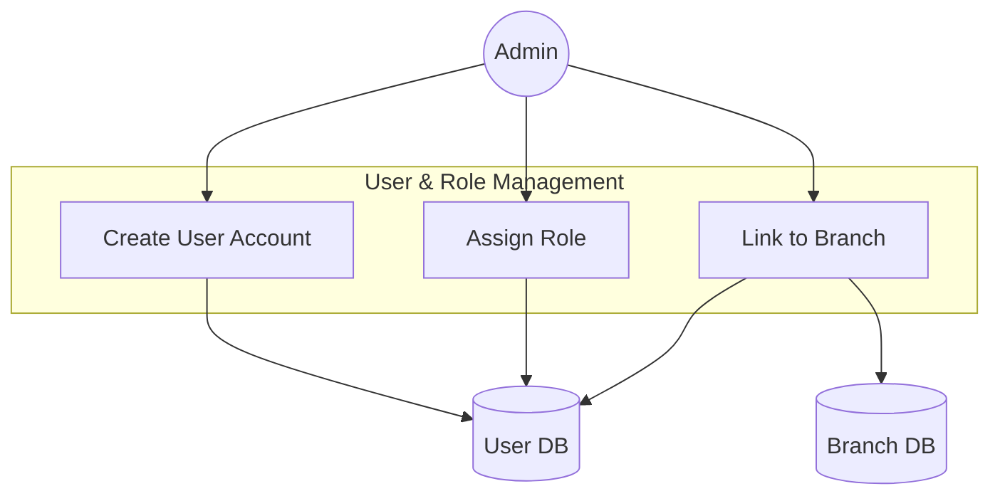

```mermaid
graph TD
    Admin((Admin))

    subgraph User & Role Management
        UR1[Create User Account]
        UR2[Assign Role]
        UR3[Link to Branch]
    end

    DS1[(User DB)]
    DS2[(Branch DB)]

    Admin --> UR1
    UR1 --> DS1

    Admin --> UR2
    UR2 --> DS1

    Admin --> UR3
    UR3 --> DS1
    UR3 --> DS2
```
