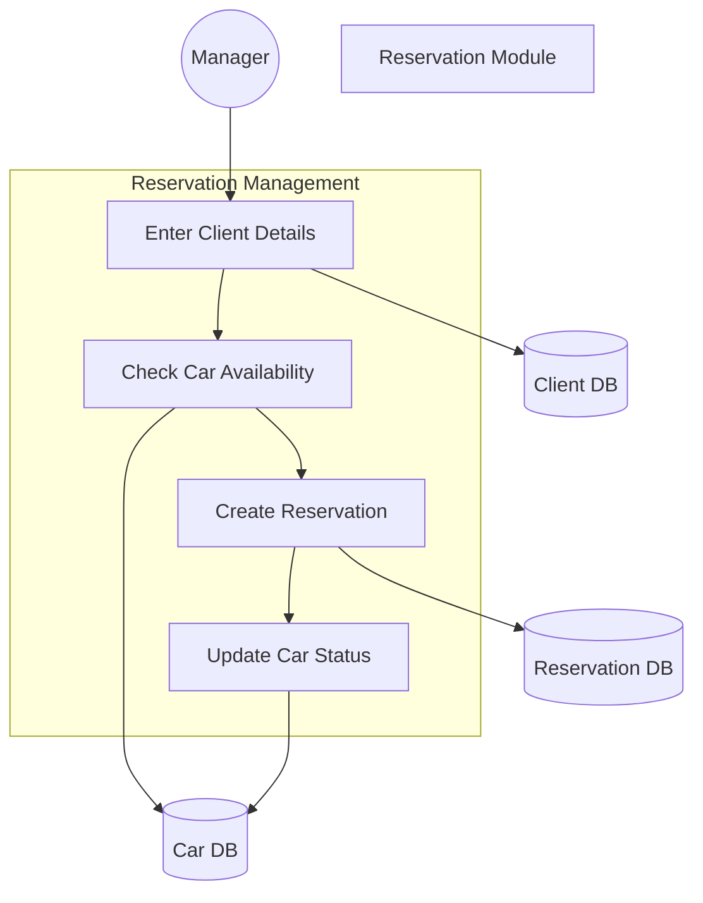

```mermaid
graph TD
    Manager((Manager))
    System[Reservation Module]

    subgraph Reservation Management
        SP1[Enter Client Details]
        SP2[Check Car Availability]
        SP3[Create Reservation]
        SP4[Update Car Status]
    end

    DS1[(Client DB)]
    DS2[(Car DB)]
    DS3[(Reservation DB)]

    Manager --> SP1
    SP1 --> DS1
    SP1 --> SP2
    SP2 --> DS2
    SP2 --> SP3
    SP3 --> DS3
    SP3 --> SP4
    SP4 --> DS2
```
