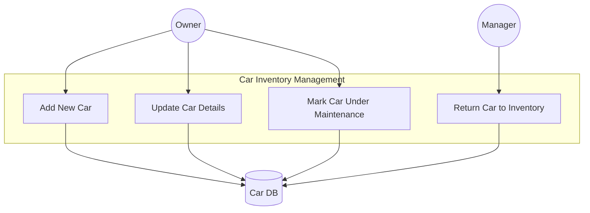

```mermaid
graph TD
    Owner((Owner))
    Manager((Manager))

    subgraph Car Inventory Management
        CI1[Add New Car]
        CI2[Update Car Details]
        CI3[Mark Car Under Maintenance]
        CI4[Return Car to Inventory]
    end

    DS[(Car DB)]

    Owner --> CI1
    CI1 --> DS
    Owner --> CI2
    CI2 --> DS
    Owner --> CI3
    CI3 --> DS
    Manager --> CI4
    CI4 --> DS
```
