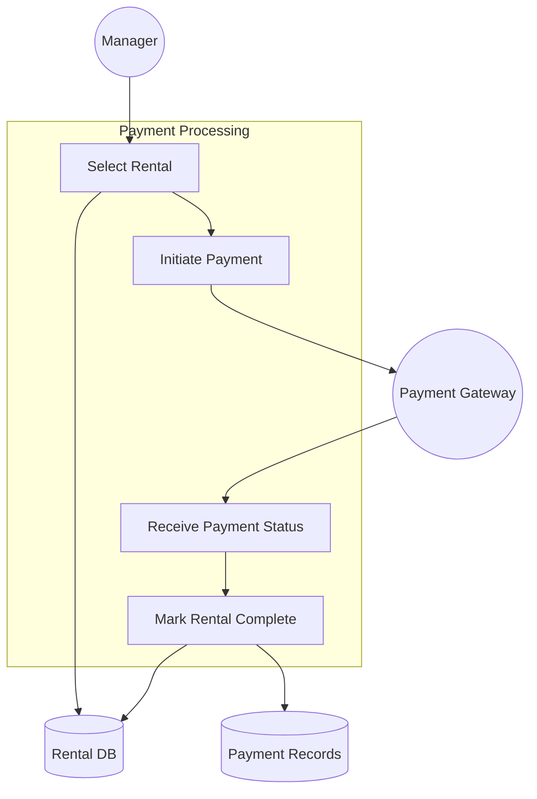

```mermaid
graph TD
    Manager((Manager))
    PaymentGateway((Payment Gateway))

    subgraph Payment Processing
        PP1[Select Rental]
        PP2[Initiate Payment]
        PP3[Receive Payment Status]
        PP4[Mark Rental Complete]
    end

    DS1[(Rental DB)]
    DS2[(Payment Records)]

    Manager --> PP1
    PP1 --> DS1
    PP1 --> PP2
    PP2 --> PaymentGateway
    PaymentGateway --> PP3
    PP3 --> PP4
    PP4 --> DS1
    PP4 --> DS2
```
