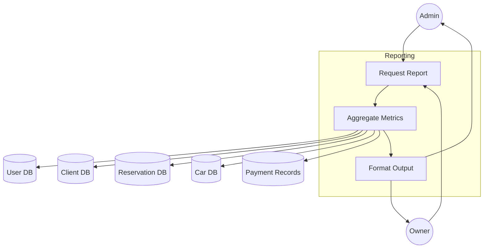

```mermaid
graph TD
    Admin((Admin))
    Owner((Owner))

    subgraph Reporting
        RP1[Request Report]
        RP2[Aggregate Metrics]
        RP3[Format Output]
    end

    DS1[(User DB)]
    DS2[(Client DB)]
    DS3[(Reservation DB)]
    DS4[(Car DB)]
    DS5[(Payment Records)]

    Admin --> RP1
    Owner --> RP1

    RP1 --> RP2
    RP2 --> DS1
    RP2 --> DS2
    RP2 --> DS3
    RP2 --> DS4
    RP2 --> DS5

    RP2 --> RP3
    RP3 --> Admin
    RP3 --> Owner
```
