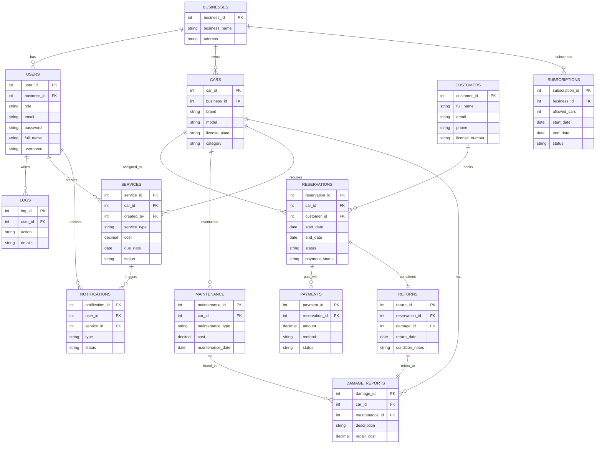

```mermaid  
erDiagram

%% === Main Entities ===  
USERS {  
int user_id PK  
int business_id FK  
string role  
string email  
string password  
string full_name  
string username  
}

BUSINESSES {  
int business_id PK  
string business_name  
string address  
}

CARS {  
int car_id PK  
int business_id FK  
string brand  
string model  
string license_plate  
string category  
}

CUSTOMERS {  
int customer_id PK  
string full_name  
string email  
string phone  
string license_number  
}

RESERVATIONS {  
int reservation_id PK  
int car_id FK  
int customer_id FK  
date start_date  
date end_date  
string status  
string payment_status  
}

RETURNS {  
int return_id PK  
int reservation_id FK  
int damage_id FK  
date return_date  
string condition_notes  
}

DAMAGE_REPORTS {  
int damage_id PK  
int car_id FK  
int maintenance_id FK  
string description  
decimal repair_cost  
}

MAINTENANCE {  
int maintenance_id PK  
int car_id FK  
string maintenance_type  
decimal cost  
date maintenance_date  
}

SERVICES {  
int service_id PK  
int car_id FK  
int created_by FK  
string service_type  
decimal cost  
date due_date  
string status  
}

NOTIFICATIONS {  
int notification_id PK  
int user_id FK  
int service_id FK  
string type  
string status  
}

PAYMENTS {  
int payment_id PK  
int reservation_id FK  
decimal amount  
string method  
string status  
}

SUBSCRIPTIONS {  
int subscription_id PK  
int business_id FK  
int allowed_cars  
date start_date  
date end_date  
string status  
}

LOGS {  
int log_id PK  
int user_id FK  
string action  
string details  
}

%% === Relationships ===  
BUSINESSES ||--o{ USERS : has  
BUSINESSES ||--o{ CARS : owns  
BUSINESSES ||--o{ SUBSCRIPTIONS : subscribes

USERS ||--o{ LOGS : writes  
USERS ||--o{ SERVICES : creates  
USERS ||--o{ NOTIFICATIONS : receives

CARS ||--o{ RESERVATIONS : assigned_to  
CARS ||--o{ MAINTENANCE : maintained  
CARS ||--o{ SERVICES : requires  
CARS ||--o{ DAMAGE_REPORTS : has

CUSTOMERS ||--o{ RESERVATIONS : books

RESERVATIONS ||--o{ PAYMENTS : paid_with  
RESERVATIONS ||--|| RETURNS : completes

RETURNS ||--|| DAMAGE_REPORTS : refers_to  
MAINTENANCE ||--o{ DAMAGE_REPORTS : found_in  
SERVICES ||--o{ NOTIFICATIONS : triggers  
```
