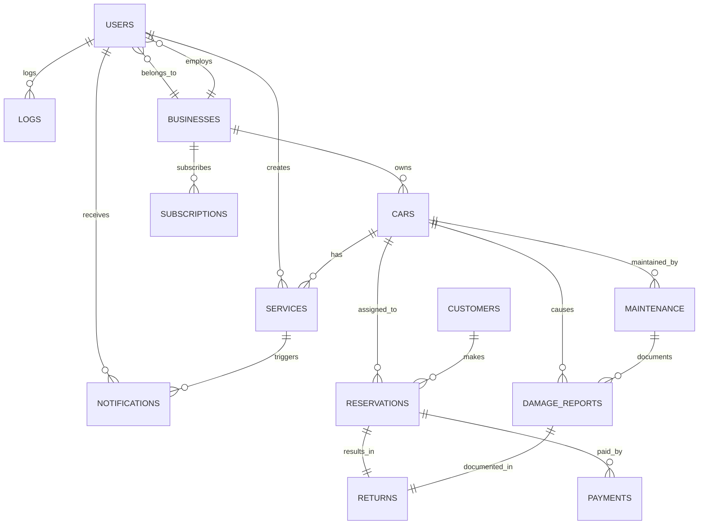

```mermaid
erDiagram
    USERS ||--o{ SERVICES : creates
    USERS ||--o{ NOTIFICATIONS : receives
    USERS ||--o{ LOGS : logs
    USERS }o--|| BUSINESSES : belongs_to

    BUSINESSES ||--o{ USERS : employs
    BUSINESSES ||--o{ CARS : owns
    BUSINESSES ||--o{ SUBSCRIPTIONS : subscribes

    CARS ||--o{ SERVICES : has
    CARS ||--o{ RESERVATIONS : assigned_to
    CARS ||--o{ MAINTENANCE : maintained_by
    CARS ||--o{ DAMAGE_REPORTS : causes

    CUSTOMERS ||--o{ RESERVATIONS : makes

    RESERVATIONS ||--|| RETURNS : results_in
    RESERVATIONS ||--o{ PAYMENTS : paid_by

    MAINTENANCE ||--o{ DAMAGE_REPORTS : documents

    DAMAGE_REPORTS ||--|| RETURNS : documented_in

    SERVICES ||--o{ NOTIFICATIONS : triggers
```
