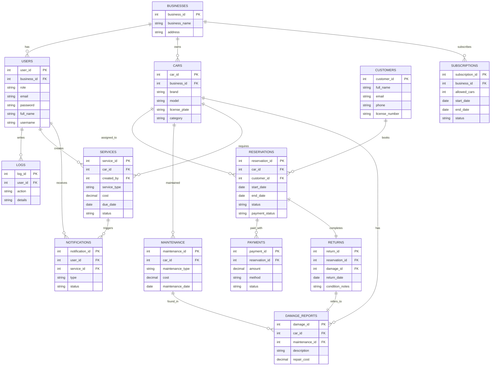

## Table of Contents

1.  **EXECUTIVE SUMMARY**
    1.1 Project Overview
    1.2 Purpose and Scope of This Specification
2.  **PRODUCT/SERVICE DESCRIPTION**
    2.1 Product Context
    2.2 User Characteristics
    2.3 Assumptions
    2.4 Constraints
    2.5 Dependencies
3.  **SOFTWARE DESIGN / DIAGRAMS**
    3.1 Requirements Analysis
        3.1.1 User Scenarios
            3.1.1.1 User Scenarios List
            3.1.1.2 User Scenarios Composite Flows
            3.1.1.3 User Scenarios Action Table
        3.1.2 Use Cases
        3.1.3 Functional Requirements
        3.1.4 Non-Functional Requirements
    3.2 Behavioral Diagrams
        3.2.1 Use Case Diagrams
        3.2.2 Activity Diagrams
        3.2.3 State Diagrams
        3.2.4 Sequence Diagrams
    3.3 Data Flow Diagrams
    3.4 Entity Relation Diagram
    3.5 Relational Schema
    3.6 Structural Diagrams
        3.6.1 Class Diagram
        3.6.2 Object Diagrams
        3.6.3 Component Diagrams
        3.6.4 Deployment Diagram
4.  **IMPLEMENTATION TECHNOLOGY**
5.  **APPENDIX – DETAILED DESIGNS**

## 1. EXECUTIVE SUMMARY

### 1.1 Project Overview
This project is a **Car Rental Management System** that allows Admins, Owners, and Managers to manage vehicles, reservations, clients, services, and branches through a centralized web platform.

### 1.2 Purpose and Scope of This Specification
This document defines the functional specifications, user interactions, data structures, and system diagrams necessary for implementing the platform. It also outlines behavioral and structural models used during the design phase.

## 2. PRODUCT/SERVICE DESCRIPTION

### 2.1 Product Context
The system is a multi-role SaaS platform for car rental businesses, supporting multi-branch structures with clearly defined user roles and responsibilities.

### 2.2 User Characteristics
- **Admin**: Creates branches, monitors reports, and manages system-wide data.  
- **Owner**: Manages branch-specific users, cars, and reservations.  
- **Manager**: Creates and updates reservations and interacts with clients.  
- **Public User**: Views public info on the homepage.

### 2.3 Assumptions
- Only authorized users can access restricted functionalities.  
- Cars are tied to a single business/branch.  
- Internet access is required to use the platform.

### 2.4 Constraints
- One reservation per car per time slot.  
- A manager is assigned to only one branch.  
- Users must operate within their role’s permission boundaries.

### 2.5 Dependencies

- **Frontend**  
  - Laravel Blade Templating Engine (for server-rendered views)  
  - Tailwind CSS and optional Alpine.js for interactivity 

- **Backend**  
  - Laravel (PHP framework) handling routing, business logic, and API endpoints  
  - Laravel Sanctum or Passport for authentication (token-based or session-based)  

- **Database Management System (DBMS)**  
  - MySQL or PostgreSQL for storing application data (users, reservations, payments, logs)  

- **PDF Library**  
  - dompdf (via Barryvdh/laravel-dompdf) for generating receipts and invoices in PDF format  

- **Authentication & Session Management**  
  - Laravel's built-in session middleware  
  - JWT (via `tymon/jwt-auth`) if using token-based API authentication


## 2. PRODUCT/SERVICE DESCRIPTION

### 2.1 Product Context
The system is a multi-role SaaS platform for car rental businesses, supporting multi-branch structures with clearly defined user roles and responsibilities.

### 2.2 User Characteristics
- **Admin**: Creates branches, monitors reports, and manages system-wide data.  
- **Owner**: Manages branch-specific users, cars, and reservations.  
- **Manager**: Creates and updates reservations and interacts with clients.  
- **Public User**: Views public info on the homepage.
### 2.3 Assumptions
- Only authorized users can access restricted functionalities.  
- Cars are tied to a single business/branch.  
- Internet access is required to use the platform.

### 2.4 Constraints
- One reservation per car per time slot.  
- A manager is assigned to only one branch.  
- Users must operate within their role’s permission boundaries.

### 2.5 Dependencies
- Frontend: Laravel Blade
- Backend: Laravel  
- DBMS: MySQL  
- PDF library: For generating receipts/invoices  
- JWT: Authentication and session management
## 3. SOFTWARE DESIGN / DIAGRAMS
### 3.1 REQUIREMENTS ANALYSIS

##### 3.1.1.1 User Scenarios List

| **#** | Name                                            | Description                                                                                                                              |
| ----- | ----------------------------------------------- | ---------------------------------------------------------------------------------------------------------------------------------------- |
| US_01 | User logs in                                    | Users: Admin, Owner, and Manager enter their credentials (email and password) to access their personalized dashboard.                    |
| US_02 | Create a reservation for a new client           | Manager creates a reservation for a new client who visits the branch, entering their details and selecting an available car.             |
| US_03 | Create a reservation for an existing client     | Manager creates a reservation for an existing client already registered in the branch’s database.                                        |
| US_04 | View reservations                               | Users: Owner and Manager view a list of pending reservations for their branch.                                                           |
| US_05 | View calendar                                   | Users: Owner and Manager view each car on a calendar reservation for their branch.                                                       |
| US_06 | Clients’ list                                   | Users: Owner and Manager view all clients registered at their branch.                                                                    |
| US_07 | Filter car in Calendar by date and availability | Users: Owner and Manager filter the cars by date and availability for easily finding cars available on those dates.                      |
| US_08 | Managers list                                   | Owner views all Managers assigned to their branch.                                                                                       |
| US_09 | Search a client                                 | Users: Owner and Manager search for a specific client by name, email, or phone number.                                                   |
| US_10 | Search a manager                                | Owner searches for a specific Manager by name or email within their branch.                                                              |
| US_11 | View own profile                                | Users: Owner and Manager view their profile details (e.g., full name, role, branch).                                                     |
| US_12 | Add a new Manager or Owner                      | Owner adds a new Manager to their branch, assigning a username, email, and password.                                                     |
| US_13 | Edit a reservation                              | Owner or Manager edit a reservation for a specific client, updating the start/end dates in the pending list.                             |
| US_14 | Remove a reservation                            | Owner can remove a reservation from the list.                                                                                            |
| US_15 | View client’s rental history                    | Owner views a specific client’s rental history. Admin can view aggregated rental data across branches.                                   |
| US_16 | Download rental receipt                         | Owner or Manager downloads a PDF receipt of a client’s rental details for record-keeping or client use.                                  |
| US_17 | View reports                                    | Owner views branch-specific reports (e.g., rental stats, revenue). Admin views platform-wide reports.                                    |
| US_18 | User logs out                                   | Users: Admin, Owner, and Manager log out from their accounts.                                                                            |
| US_19 | Add new car                                     | Owner or Manager adds a new car to the branch’s inventory, provided it’s within the subscription limit.                                  |
| US_20 | View car inventory                              | Users: Owner and Manager view the full list of cars in the branch, including statuses (e.g., available, rented).                         |
| US_21 | Add new branch                                  | Admin adds a new branch to the platform, assigning an Owner and setting the time and subscription.                                       |
| US_22 | View activity logs                              | Owner views a log of all actions within their branch (e.g., car added, reservation updated).                                             |
| US_23 | View Manager activity report                    | Owner views a report detailing reservations and actions performed by Managers in their branch.                                           |
| US_24 | Mark a reservation as returned                  | Owner or Manager marks a reservation as returned when the client brings back the car, updating its status to available.                  |
| US_25 | Adding days to a reservation                    | Owner or Manager extends the reservation by adding how many days the client keeps or wants to keep the car longer.                       |
| US_26 | View main page before logging in                | Users access the main page before logging in to read general information about the car rental platform.                                  |
| US_27 | View Overview (Dashboard Home)                  | Users: Owner and Manager view a dashboard with key metrics upon logging in. Admin sees platform-wide overview.                           |
| US_28 | View Upcoming Returns                           | Users: Owner and Manager view a list of cars scheduled to be returned today or tomorrow for their branch.                                |
| US_29 | Search car with license plate                   | Users: Owner and Manager search for a specific car by its license plate number to view its status and rental history.                    |
| US_30 | Filter reservations                             | Users: Owner and Manager filter reservations by car, client, or status (e.g., show only pending reservations for a specific car).        |
| US_31 | Attach return notes & additional fees           | Owner or Manager attaches notes (e.g., “minor scratch on door”) and additional fees (e.g., $20 late fee) when marking a car as returned. |
| US_32 | Generate final invoice after return             | Owner or Manager generates a final invoice (e.g., PDF) including rental cost, additional fees, and notes after a car is returned.        |
| US_33 | Add services and maintenance for cars           | Owner adds car service/maintenance (e.g., oil change, cost, date) and updates car status (e.g., in service).                             |
| US_34 | View car services and maintenance history       | Users: Owner and Manager view a car’s service history (e.g., type, date, cost, status) in a table.                                       |
| US_35 | Check payment page                              | Admin expands to show all payments, with method details.                                                                                 |
| US_36 | Generate invoice from payment page              | Allows Owners to create an invoice from the payment page, consolidating client payments (online/cash) and rental details.                |

---

##### 3.1.1.2 User Scenarios Composite Flows

| Composite Flow                     | User Goal                                                | Actions                                        | Outcome                                                         |
| ---------------------------------- | -------------------------------------------------------- | ---------------------------------------------- | --------------------------------------------------------------- |
| Set up a new operational branch    | Admin needs to onboard a new franchise branch            | Log in to the platform (UC_01)                 | Admin dashboard is accessed                                     |
|                                    |                                                          | Add a new Owner for the branch (UC_12)         | Owner account is created and notified                           |
|                                    |                                                          | Create a new branch with subscription (UC_21)  | Branch is added to the system and linked to a subscription plan |
|                                    |                                                          | View reports for platform-wide metrics (UC_17) | Admin sees new branch stats                                     |
| Process a car reservation          | Manager needs to book a car for a customer               | Log in to the platform (UC_01)                 | Manager dashboard is accessed                                   |
|                                    |                                                          | Enter client details (UC_05)                   | Client details saved                                            |
|                                    |                                                          | Check car availability (UC_06)                 | System checks car availability                                  |
|                                    |                                                          | Save reservation (UC_07)                       | Reservation is saved                                            |
|                                    |                                                          | Mark car as rented (UC_08)                     | Car is assigned and marked as rented                            |
|                                    |                                                          | Notify Owner if no cars (UC_19)                | Owner is alerted about unavailability (conditional)             |
| Register new client and rent car   | Manager needs to onboard a new customer and assign a car | Log in to the platform (UC_01)                 | Manager dashboard is accessed                                   |
|                                    |                                                          | Register new client (UC_04)                    | Client is created in the system                                 |
|                                    |                                                          | Check car availability (UC_06)                 | System verifies availability                                    |
|                                    |                                                          | Save reservation (UC_07)                       | Reservation is saved                                            |
|                                    |                                                          | Mark car as rented (UC_08)                     | Car is assigned and marked as rented                            |
| Process payment and close rental   | Manager finalizes a rental transaction                   | View ongoing rentals (UC_09)                   | Ongoing rental is selected                                      |
|                                    |                                                          | Process payment (UC_10)                        | Payment is recorded                                             |
|                                    |                                                          | Mark rental as complete (UC_11)                | Rental is closed                                                |
|                                    |                                                          | View reports (UC_17)                           | Reports updated with completed rental                           |
| Manage car inventory               | Owner/Manager maintains vehicle availability             | Add new car (UC_13)                            | New vehicle registered                                          |
|                                    |                                                          | View/update car list (UC_14)                   | Car list reviewed or updated                                    |
|                                    |                                                          | Mark car under maintenance (UC_15)             | Vehicle marked unavailable for rental                           |
|                                    |                                                          | Return car to inventory (UC_16)                | Vehicle marked available again                                  |
| Onboard new users and assign roles | Admin adds staff and assigns responsibilities            | Log in to the platform (UC_01)                 | Admin dashboard is accessed                                     |
|                                    |                                                          | Register new user (UC_02)                      | New user account is created                                     |
|                                    |                                                          | Assign role and branch (UC_03)                 | Role and permissions assigned                                   |

---

##### 3.1.1.3 User Scenarios Action Table


| User Goal                              | Context                               | Actions                                   | Outcome                                             |
| -------------------------------------- | ------------------------------------- | ----------------------------------------- | --------------------------------------------------- |
| Log in                                 | User visits login page                | Enter email and password                  | Access granted to personalized dashboard            |
| Log in                                 | Credentials invalid                   | Submit login form                         | Error message shown, user asked to retry            |
| Create new client reservation          | Manager logged in, new client arrives | Enter client details and select car       | Reservation created, car status updated to "rented" |
| Create existing client reservation     | Manager logged in, client registered  | Select client and car, enter rental dates | Reservation created, car status updated to "rented" |
| View reservations                      | Owner or Manager logged in            | Navigate to reservations page             | List of pending reservations displayed              |
| View calendar                          | Owner or Manager logged in            | Navigate to calendar page                 | Calendar shows reservations by date and car         |
| Filter calendar by date & availability | Owner or Manager logged in            | Apply date and availability filters       | Filtered cars displayed in calendar                 |
| View clients list                      | Owner or Manager logged in            | Navigate to clients page                  | List of registered clients displayed                |
| View managers list                     | Owner logged in                       | Navigate to managers page                 | List of branch managers displayed                   |
| Search client                          | Owner or Manager logged in            | Search client by name/email/phone         | Matching clients displayed                          |
| Search manager                         | Owner logged in                       | Search manager by name/email              | Matching managers displayed                         |
| View own profile                       | Owner or Manager logged in            | Navigate to profile page                  | User profile details shown                          |
| Add new Manager or Owner               | Owner logged in                       | Enter new user details and assign role    | New user added and notified                         |
| Edit a reservation                     | Owner or Manager logged in            | Select reservation and edit details       | Reservation updated                                 |
| Remove a reservation                   | Owner logged in                       | Select reservation and confirm removal    | Reservation removed, car marked available           |
| View client rental history             | Owner logged in                       | Select client and view rental history     | Client’s past rentals displayed                     |
| Download rental receipt                | Owner or Manager logged in            | Select reservation and download receipt   | Rental receipt PDF generated and downloaded         |
| View reports                           | Owner or Admin logged in              | Select report type and date range         | Reports displayed with metrics                      |
| User logs out                          | User logged in                        | Click logout                              | Session ended, redirected to login                  |
| Add new car                            | Owner or Manager logged in            | Enter car details and save                | Car added to inventory                              |
| View car inventory                     | Owner or Manager logged in            | Navigate to cars page                     | List of cars with statuses displayed                |
| Add new branch                         | Admin logged in                       | Enter branch and owner details, save      | Branch created and owner notified                   |
| View activity logs                     | Owner logged in                       | Navigate to activity logs                 | Branch activity logs displayed                      |
| View Manager activity report           | Owner logged in                       | Select manager and date range             | Manager activity report displayed                   |
| Mark reservation as returned           | Owner or Manager logged in            | Mark reservation as returned              | Reservation status updated, car marked available    |
| Add days to a reservation              | Owner or Manager logged in            | Enter extension days and confirm          | Reservation extended                                |
| View main page before login            | Guest visits site                     | Browse main page                          | General platform info displayed                     |
| View dashboard overview                | Owner, Manager, Admin logged in       | Access dashboard                          | Key metrics displayed                               |
| View upcoming returns                  | Owner or Manager logged in            | Access upcoming returns page              | List of upcoming returns displayed                  |
| Search car by license plate            | Owner or Manager logged in            | Enter license plate and search            | Car details displayed                               |
| Filter reservations                    | Owner or Manager logged in            | Apply filters on reservations list        | Filtered reservations displayed                     |
| Attach return notes & fees             | Owner or Manager logged in            | Add notes and fees on returned car        | Notes and fees saved                                |
| Generate final invoice                 | Owner or Manager logged in            | Generate invoice after return             | PDF invoice generated                               |
| Add services/maintenance               | Owner or Manager logged in            | Enter service details and update status   | Service recorded and status updated                 |
| View service history                   | Owner or Manager logged in            | View car’s service records                | Service history displayed                           |
| Check payment page                     | Admin logged in                       | View payment records                      | Payments data displayed                             |
| Generate invoice from payment          | Owner logged in                       | Generate invoice from payment page        | Invoice PDF created                                 |

---

##### User Personas

| Persona Name    | Role           | Goals                                                       | Characteristics                                           | Typical Actions                                              |
| --------------- | -------------- | ----------------------------------------------------------- | --------------------------------------------------------- | ------------------------------------------------------------ |
| **Admin**       | System Admin   | Manage branches, oversee platform-wide reports and payments | Oversees multiple branches, controls subscriptions, users | Add branches, manage Owners, view platform-wide reports      |
| **Owner**       | Branch Owner   | Manage branch resources, users, reports                     | Responsible for branch operations, user & car management  | Add Managers, view reservations, add cars, generate invoices |
| **Manager**     | Branch Manager | Manage client reservations and rentals                      | Frontline operator interacting with clients               | Create reservations, download receipts, update rentals       |
| **Client/User** | End User       | Rent vehicles, view rental info                             | Accesses dashboard for personal rental data               | Log in, view dashboard, request rentals via Manager          |
| **Guest**       | Visitor        | Learn about platform services                               | No login required                                         | View main page, browse info, choose to log in                |

---
#### 3.1.2 User Cases
Use case tables have been created for **US_01 to US_36**, each with:
- Actor(s)
- Preconditions
- Postconditions
- Main Flow
- Alternative Flows

US_01 – User Logs In

| Field             | Description                                                                                                      |
| ----------------- | ---------------------------------------------------------------------------------------------------------------- |
| Use Case ID       | US_01                                                                                                            |
| Name              | User Logs In                                                                                                     |
| Actor(s)          | Admin, Owner, Manager                                                                                            |
| Description       | Allows users to log in using their credentials and access their dashboard.                                       |
| Preconditions     | User must be registered.                                                                                         |
| Postconditions    | User is authenticated and redirected to dashboard.                                                               |
| Main Flow         | 1. User enters email and password. <br> 2. System verifies credentials. <br> 3. User is redirected to dashboard. |
| Alternative Flows | Invalid credentials → System shows an error message.                                                             |

US_02 – Create a Reservation for a New Client

| Field             | Description                                                                                                                                         |
| ----------------- | --------------------------------------------------------------------------------------------------------------------------------------------------- |
| Use Case ID       | US_02                                                                                                                                               |
| Name              | Create a Reservation for a New Client                                                                                                               |
| Actor(s)          | Manager                                                                                                                                             |
| Description       | Manager creates a reservation by adding a new client.                                                                                               |
| Preconditions     | Client is not in the system.                                                                                                                        |
| Postconditions    | New client and reservation are saved.                                                                                                               |
| Main Flow         | 1. Manager inputs client details. <br> 2. System saves client. <br> 3. Manager selects car and reservation dates. <br> 4. System saves reservation. |
| Alternative Flows | Client info missing → System prompts to complete required fields.                                                                                   |

US_03 – Create a Reservation for an Existing Client

| Field             | Description                                                                                                                          |
| ----------------- | ------------------------------------------------------------------------------------------------------------------------------------ |
| Use Case ID       | US_03                                                                                                                                |
| Name              | Create a Reservation for an Existing Client                                                                                          |
| Actor(s)          | Manager                                                                                                                              |
| Description       | Manager books a car for an existing client.                                                                                          |
| Preconditions     | Client exists in the system.                                                                                                         |
| Postconditions    | Reservation is created for selected client.                                                                                          |
| Main Flow         | 1. Manager searches for client. <br> 2. Selects client. <br> 3. Selects car and reservation dates. <br> 4. System saves reservation. |
| Alternative Flows | Client not found → Manager retries search.                                                                                           |

See section 3.2.1 for the full Use Case Diagram.

#### 3.1.3 Functional Requirements (FR)
1. The system shall allow Admins, Owners, and Managers to log in and log out.
2. Managers shall be able to create reservations for new or existing clients.
3. Owners and Managers shall be able to view and filter reservations.
4. The system shall allow Owners and Managers to manage a calendar view of car availability.
5. The system shall support client and manager search functionality.
6. Owners shall be able to add, edit, and delete Managers.
7. Owners and Managers shall be able to add, edit, and remove reservations.
8. The system shall generate and download invoices and receipts.
9. Admins shall be able to create and manage branches and subscriptions.
10. Owners and Managers shall manage car inventory, services, and maintenance.
11. The system shall send notifications and maintain logs of all critical actions.
12. The system shall allow owners to view reports and usage statistics.
13. Cars can be marked as returned and reservation duration can be extended.
14. Damage reports and return notes can be attached to each reservation.
15. Admins shall view all payments and generate consolidated invoices.

#### 3.1.4 Non-Functional Requirements (NFR)
1. **Performance**: The system should respond to user actions within 2 seconds under normal load.
2. **Availability**: The application must be available 99.5% of the time during business hours.
3. **Security**:
   - Passwords must be hashed using bcrypt.
   - All sensitive data must be transmitted over HTTPS.
   - JWT-based authentication must be used.
4. **Scalability**: The system should scale to support multiple branches and up to 5000 users.
5. **Maintainability**: Codebase should be modular and documented using industry-standard practices.
6. **Portability**: The application must be containerized using Docker.
7. **Data Integrity**: Transactions involving payments, returns, or updates must be ACID-compliant.
8. **Auditability**: Logs of user actions must be recorded and available for export.
9. **Localization**: The system must support multilingual interfaces in future versions.
10. **Compliance**: Must comply with GDPR for handling customer data in the EU.
### 3.2 BEHAVIORAL DIAGRAMS

#### 3.2.1 Use Case Diagrams

This section provides visual representations of the core functionalities of the Car Rental Management System from the perspectives of different user roles: **Admin**, **Owner**, and **Manager**. Each use case diagram highlights the key interactions between system actors and the system itself, helping to identify role-specific responsibilities and system boundaries.

---

##### 3.2.1.1 System-Wide Use Case Diagram

The following diagram gives a holistic overview of the entire system, showing how all major actors interact with the system and its key functionalities.


---

##### 3.2.1.2 Reservation Management Use Cases

This diagram focuses on actions related to managing client reservations, handled primarily by **Managers** and **Owners**.


---

##### 3.2.1.3 User & Branch Management Use Cases

This diagram shows how **Admins** and **Owners** manage users and operational branches.


---

##### 3.2.1.4 Reporting & Notifications Use Cases

This diagram highlights reporting, notifications, and audit-related actions for **Admins** and **Owners**.


---
#### 3.2.2 Activity Diagrams

This section presents **activity diagrams** for key use cases in the Car Rental Management System. Activity diagrams illustrate the flow of control between system actions and user interactions across multiple actors, organized using **vertical swimlanes** for clarity.

Each diagram is structured to show decision points, parallel processes, and the sequence of activities from start to end. Actors involved include **Admin**, **Owner**, and **Manager**.

---

##### 3.2.2.1 Login Flow


---

##### 3.2.2.2 Create New Reservation


---

##### 3.2.2.3 Handle Return and Generate Invoice


---

##### 3.2.2.4 Admin: Add New Branch


---

##### 3.2.2.5 View Reports and Analytics


---
#### 3.2.3 State Diagrams

This section presents **state diagrams** to illustrate how key entities (such as reservations and cars) change states throughout their lifecycle in the Car Rental Management System. State diagrams are useful for understanding object behavior, especially for time-dependent transitions or status-based workflows.

---

##### 3.2.3.1 Reservation State Diagram


---

##### 3.2.3.2 Car State Diagram


---

##### 3.2.4.2 Create New Reservation


---

##### 3.2.4.3 Handle Car Return and Invoice Generation


---

##### 3.2.4.4 Admin Creates a New Branch


---

##### 3.2.4.5 View Reports and Analytics


---

### 3.3 Data Flow Diagrams

This section presents **Data Flow Diagrams (DFDs)** that depict how data moves through the app. DFDs help visualize system boundaries, inputs/outputs, data storage, and the flow between system processes and external actors.

---

#### 3.3.1 Level 0 – Context Diagram

The context diagram shows the system as a single high-level process with its external entities.


---

#### 3.3.2 Level 1 – Main System Processes

The Level 1 DFD breaks the system into major functional modules.


---

#### 3.3.3 Level 2 – Reservation Management

This diagram breaks down the `Reservation Management` process in more detail, showing how data flows internally when creating a reservation.


---


### 3.4 ENTITY RELATION DIAGRAM

This ERD defines the relational structure of the Car Rental Management System, based on the database schema.


Entities such as `USERS`, `CARS`, `RESERVATIONS`, and `PAYMENTS` are connected by logical foreign key relationships. The schema supports role-based data partitioning and service operations.

### 3.5 RELATIONAL SCHEMA (Mermaid ER Diagram)


### 3.6 STRUCTURAL DIAGRAMS

#### 3.6.1 Class Diagram

```mermaid  
classDiagram

%% === Users ===  
class Users {  
+user_id: integer  
+business_id: integer  
+username: varchar  
+password: varchar  
+role: varchar  
+email: varchar  
+phone: varchar  
+full_name: varchar  
+status: varchar  
+created_at: timestamp  
+updated_at: timestamp

+login()  
+logout()  
+createUser()  
+updateProfile()  
+deactivateAccount()  
}

%% === Businesses ===  
class Businesses {  
+business_id: integer  
+business_name: varchar  
+address: text  
+contact_info: varchar  
+created_at: timestamp  
+updated_at: timestamp

+registerBusiness()  
+getUsers()  
+updateBusinessInfo()  
}

%% === Cars ===  
class Cars {  
+car_id: integer  
+business_id: integer  
+brand: varchar  
+model: varchar  
+year: integer  
+license_plate: varchar  
+category: varchar  
+created_at: timestamp  
+updated_at: timestamp

+addCar()  
+updateCar()  
+markAsRented()  
+markAsAvailable()  
+getServiceHistory()  
}

%% === Services ===  
class Services {  
+service_id: integer  
+car_id: integer  
+service_type: varchar  
+cost: decimal  
+due_date: timestamp  
+status: varchar  
+created_by: integer  
+created_at: timestamp  
+updated_at: timestamp

+createService()  
+markAsPaid()  
+getDueServices()  
}

%% === Customers ===  
class Customers {  
+customer_id: integer  
+full_name: varchar  
+email: varchar  
+phone: varchar  
+license_number: varchar  
+license_plase: varchar  
+created_at: timestamp  
+updated_at: timestamp

+registerCustomer()  
+updateCustomerInfo()  
+getRentalHistory()  
}

%% === Reservations ===  
class Reservations {  
+reservation_id: integer  
+car_id: integer  
+customer_id: integer  
+start_date: timestamp  
+end_date: timestamp  
+status: varchar  
+payment_status: varchar  
+total_cost: decimal  
+created_at: timestamp  
+updated_at: timestamp

+createReservation()  
+cancelReservation()  
+updateReservation()  
+getInvoice()  
}

%% === Returns ===  
class Returns {  
+return_id: integer  
+reservation_id: integer  
+return_date: timestamp  
+condition_notes: text  
+damage_id: integer  
+mileage: integer  
+additional_fees: decimal  
+final_invoice_amount: decimal  
+created_at: timestamp  
+updated_at: timestamp

+markAsReturned()  
+addReturnNotes()  
+calculateFees()  
}

%% === Maintenance ===  
class Maintenance {  
+maintenance_id: integer  
+car_id: integer  
+maintenance_type: varchar  
+maintenance_date: timestamp  
+cost: decimal  
+comments: text  
+created_at: timestamp  
+updated_at: timestamp

+logMaintenance()  
+getMaintenanceReport()  
}

%% === Damage Reports ===  
class Damage_Reports {  
+damage_id: integer  
+car_id: integer  
+maintenance_id: integer  
+description: text  
+repair_cost: decimal  
+reported_at: timestamp  
+resolved_at: timestamp

+reportDamage()  
+updateDamageStatus()  
}

%% === Payments ===  
class Payments {  
+payment_id: integer  
+reservation_id: integer  
+amount: decimal  
+payment_method: varchar  
+payment_date: timestamp  
+status: varchar  
+created_at: timestamp  
+updated_at: timestamp

+processPayment()  
+getPaymentDetails()  
+markAsCompleted()  
}

%% === Notifications ===  
class Notifications {  
+notification_id: integer  
+user_id: integer  
+service_id: integer  
+message: text  
+type: varchar  
+status: varchar  
+created_at: timestamp  
+updated_at: timestamp

+sendNotification()  
+markAsRead()  
+getUnreadNotifications()  
}

%% === Logs ===  
class Logs {  
+log_id: integer  
+user_id: integer  
+action: varchar  
+details: text  
+created_at: timestamp

+logAction()  
+getLogsByUser()  
}

%% === Subscriptions ===  
class Subscriptions {  
+subscription_id: integer  
+business_id: integer  
+allowed_cars: integer  
+start_date: timestamp  
+end_date: timestamp  
+amount: decimal  
+status: varchar  
+created_at: timestamp  
+updated_at: timestamp

+startSubscription()  
+updatePlan()  
+checkCarLimit()  
}

%% === Relationships ===

Businesses --> Users : has_users  
Businesses --> Cars : owns_cars  
Businesses --> Subscriptions : has_subscriptions

Users --> Services : creates_services  
Users --> Notifications : receives_notifications  
Users --> Logs : generates_logs

Cars --> Services : serviced_by  
Cars --> Reservations : reserved_in  
Cars --> Maintenance : maintained_by  
Cars --> Damage_Reports : damaged_in

Customers --> Reservations : books

Reservations --> Returns : has_return  
Reservations --> Payments : has_payments

Returns --> Damage_Reports : logs_damage  
Maintenance --> Damage_Reports : associated_damage  
Services --> Notifications : notifies  
```

### 3.6.2 Object Diagrams

This section provides **Object Diagrams** that represent specific runtime instances of classes and their relationships at a particular moment. While class diagrams describe the static structure, object diagrams illustrate **real data examples** (i.e., objects and links) in action.

---

#### 3.6.2.1 Object Diagram: Active Reservation Scenario

```mermaid
classDiagram
  class Manager {
    user_id = 12
    username = "j.doe"
    role = "Manager"
  }

  class Client {
    client_id = 33
    full_name = "Alice Smith"
    license_number = "LS12345"
  }

  class Car {
    car_id = 7
    make = "Toyota"
    model = "Corolla"
    plate_number = "AB123CD"
    available = false
  }

  class Reservation {
    reservation_id = 105
    start_time = "2025-06-01 10:00"
    end_time = "2025-06-03 16:00"
    returned = false
  }

  class Branch {
    branch_id = 3
    name = "Tirana HQ"
  }

  Manager --> Reservation : created
  Client --> Reservation : books
  Reservation --> Car : uses
  Manager --> Branch : works at
  Car --> Branch : assigned to
```

---

#### 3.6.2.2 Returned Car with Payment and Damage Report

```mermaid
classDiagram
  class Manager {
    user_id = 14
    username = "e.mira"
  }

  class Client {
    client_id = 45
    full_name = "Blerim Hoxha"
  }

  class Car {
    car_id = 18
    make = "BMW"
    model = "X5"
    plate_number = "TR456BN"
    available = true
  }

  class Reservation {
    reservation_id = 210
    returned = true
    notes = "Rear bumper dent"
  }

  class Payment {
    payment_id = 76
    amount = 245.00
    method = "Card"
  }

  class Invoice {
    invoice_id = 42
    total = 245.00
  }

  Manager --> Reservation
  Client --> Reservation
  Reservation --> Car
  Reservation --> Payment
  Payment --> Invoice
```

---
#### 3.6.2.3 Branch and User Management Snapshot

```mermaid
classDiagram
  class Admin {
    user_id = 1
    username = "admin01"
  }

  class Owner {
    user_id = 5
    username = "owner01"
  }

  class Manager {
    user_id = 9
    username = "mgr.albani"
  }

  class Branch {
    branch_id = 2
    name = "Durres Station"
  }

  Admin --> Branch : creates
  Owner --> Branch : assigned_to
  Owner --> Manager : manages
  Manager --> Branch : operates_at
```

---
#### 3.6.2.4 Maintenance Workflow Snapshot

```mermaid
classDiagram
  class Manager {
    user_id = 22
    username = "k.bashkim"
  }

  class Car {
    car_id = 31
    make = "Ford"
    model = "Focus"
    plate_number = "DR789RT"
    available = false
  }

  class Maintenance {
    maintenance_id = 88
    date = "2025-06-05"
    description = "Oil and brake replacement"
    cost = 150.00
  }

  class Branch {
    branch_id = 4
    name = "Shkodra Center"
  }

  Manager --> Car : flags for maintenance
  Car --> Maintenance : has
  Car --> Branch : assigned_to
```

### 3.6.3 Component Diagram

This section presents the **Component Diagram** of the Car Rental Management System. A component diagram shows how the system is decomposed into logical, replaceable modules and how these modules interact through interfaces and data exchange. It helps visualize the **high-level architecture** and is useful for deployment planning and system scalability.

```mermaid  
graph TD

%% === External Users ===  
Client[Client / Customer]  
Manager[Manager]  
Owner[Owner]  
Admin[Admin]

%% === UI Layer ===  
UI[Web Frontend]

Client --> UI  
Manager --> UI  
Owner --> UI  
Admin --> UI

%% === Backend Layer ===  
UI --> API[REST API Server]

API --> AuthService[Auth Service]  
API --> ReservationService[Reservation Service]  
API --> UserService[User Service]  
API --> CarService[Car Service]  
API --> ReportingService[Reporting Service]  
API --> NotificationService[Notification Service]  
API --> MaintenanceService[Maintenance Service]  
API --> PDFService[PDF Generator]

%% === Database Layer ===  
API --> DB[(SQL Database)]

DB --> UsersTable[Users]  
DB --> CarsTable[Cars]  
DB --> ReservationsTable[Reservations]  
DB --> PaymentsTable[Payments]  
DB --> ReturnsTable[Returns]  
DB --> DamageReportsTable[Damage Reports]  
DB --> MaintenanceTable[Maintenance]  
DB --> ServicesTable[Services]  
DB --> LogsTable[Logs]  
DB --> NotificationsTable[Notifications]  
DB --> SubscriptionsTable[Subscriptions]

%% === External Services ===  
NotificationService --> EmailService[Email or SMS Gateway]  
PDFService --> FileStorage[File Storage Service]  
ReportingService --> ChartService[Chart Reporting Engine]  
```

---

### 3.6.4 Deployment Diagram

The **Deployment Diagram** describes the physical architecture of the Car Rental Management System, showing how software components are distributed across hardware nodes (servers, databases, client devices). It helps clarify system topology, hosting environments, and inter-component communication.

---
#### 3.6.4.1 Deployment Architecture

```mermaid
flowchart TD
  Browser["Web Browser"]

  subgraph AppServer["Application Server"]
    Nginx["Nginx Reverse Proxy"]
    API["Backend API"]
    Services["Auth, Reservation, etc."]
  end

  subgraph DBServer["Database Server"]
    DB["Relational DB (MySQL)"]
    FileStorage["File Storage (S3 / Local)"]
  end

  Browser --> Nginx
  Nginx --> API
  API --> Services
  Services --> DB
  Services --> FileStorage
```


---

#### 3.6.4.2 Deployment Environment

- **Client Layer**:  
    Users access the application through a web browser. The frontend is rendered server-side using **Laravel Blade templates**, styled with **Tailwind CSS**, and enhanced with **JavaScript** for interactivity. All pages are routed via Laravel’s `web.php`.
- **Application Server**:
    - Handles HTTP requests using the **Laravel** PHP framework.
    - Business logic is organized using Laravel controllers, services, and middleware.
    - Routing is handled by Laravel's built-in routing engine.
    - Hosted on a **Linux-based server** with **PHP-FPM** and **Nginx** (or Apache).
    - Form submissions, session management, and CSRF protection are handled by Laravel natively.
        
- **Database Server**:
    - A relational database  stores all application data, including users, reservations, invoices, and logs.
    - Laravel Eloquent ORM is used for all database interactions.
    - File uploads (e.g., receipts, documents) are managed via Laravel's filesystem and stored locally or in cloud storage (e.g., Amazon S3).

---

#### 3.6.4.3 Hosting Options

- **Local Deployment** (Docker Compose / VMs)
- **Cloud Deployment** (e.g., AWS EC2 + RDS + S3)
- **Hybrid Deployment** (cloud DB + local services)

---

## 4. IMPLEMENTATION TECHNOLOGY

This section outlines the key technologies, frameworks, tools, and architectural choices used to implement the Car Rental Management System. The chosen stack prioritizes performance, modularity, scalability, and developer productivity.

---

### 4.1 Frontend

- **Framework**: Laravel Blade Templating Engine
- **Language**: PHP, HTML, JavaScript
- **Styling**: Tailwind CSS
- **Routing**: Laravel Web Routes (`routes/web.php`)
- **Forms**: Blade Forms with CSRF protection (`@csrf`, `old()`, validation errors)
- **Build Tool**: Vite (via Laravel Mix or default setup)

---

### 4.2 Backend
- **Framework**: Laravel (PHP)
- **Authentication**: 
  - Laravel Sanctum or Passport for token-based authentication  
  - Bcrypt (default in Laravel) for password hashing
- **Business Logic**: 
  - Service-oriented architecture using Controllers, Service classes, and Repositories
- **API Protocol**: 
  - RESTful API with JSON responses over HTTPS  
  - Defined in `routes/api.php`
- **Validation**: 
  - Laravel Form Request classes (`Illuminate\Foundation\Http\FormRequest`)  
  - Built-in `Validator` facade for manual validation
- **Testing**: 
  - Laravel's built-in testing tools using PHPUnit  
  - Optional: Laravel Dusk for browser testing


---

### 4.3 Database
- **RDBMS**: MySQL or PostgreSQL  
- **ORM/Query Layer**: 
  - Eloquent ORM (Laravel's built-in ORM)  
  - Optional: Fluent query builder for complex queries
- **Schema Management**: 
  - Laravel Migrations for version-controlled database schema changes  
  - Optional: Laravel Seeders and Factories for test and dummy data generation

---

### 4.4 DevOps & Deployment

- **Containerization**: Docker & Docker Compose
- **Web Server**: Nginx (reverse proxy, SSL termination)
- **CI/CD**: GitHub Actions / GitLab CI
- **Monitoring & Logging**: PM2, Logrotate, Grafana, or custom logging middleware
- **Environment**: `.env` files, `.dockerignore`, secrets manager for production

---

### 4.5 Optional Enhancements

- **Notifications**: Email (Nodemailer / SMTP), SMS (Twilio API)
- **Cloud Services**: AWS S3 (file storage), RDS (managed DB), EC2
- **Access Control**: RBAC (Role-Based Access Control) for Admin, Owner, Manager

---
## 5. Appendix – Detailed Designs

This section contains references to detailed design artifacts, additional documentation, and resources used throughout the project.

### 5.1 Supporting Documents

- **Use Case Tables**: Detailed for all 36 use cases with preconditions, postconditions, and actors.
- **Sequence Diagrams**: Individual Mermaid-based diagrams for each use case using actual method names.
- **Activity Diagrams**: Step-by-step action flows covering all user workflows.
- **Class Diagram**: Full system-wide class structure with attributes and methods.
- **ERD**: Complete relational structure showing foreign key relationships and logical grouping.
- **Component Diagram**: Frontend/backend decomposition including services and DB communication.
- **Deployment Diagram**: Runtime environment setup showing servers and interconnections.
- **Relational Schema**: Tabular mapping of all entities and their field types.
- **Object Diagram**: Example snapshot of runtime entity instances.
- **Use Case Diagram**: High-level overview of actor-system interaction.