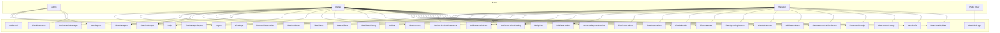

```mermaid
%% Use Case Diagram: Car Rental System

%%{ init: { 'theme': 'default' } }%%
graph TD
    subgraph Actors
        Admin
        Owner
        Manager
        PublicUser[Public User]
    end

    subgraph System
        Login
        Logout
        ViewDashboard
        ViewMainPage
        AddBranch
        AddOwnerOrManager
        ViewManagers
        SearchManager
        ViewClients
        SearchClient
        ViewClientHistory
        ViewReports
        ViewManagerReport
        ViewLogs
        AddCar
        ViewInventory
        AddReservationNew
        AddReservationExisting
        EditReservation
        RemoveReservation
        FilterReservations
        ViewReservations
        ViewCalendar
        FilterCalendar
        ViewUpcomingReturns
        MarkAsReturned
        AddReturnNotes
        GenerateInvoiceAfterReturn
        DownloadReceipt
        AddServiceOrMaintenance
        ViewServiceHistory
        NotifyUser
        CheckPayments
        GeneratePaymentInvoice
        ViewProfile
        SearchCarByPlate
    end

    %% Actor Use Case Links
    PublicUser --> ViewMainPage

    Admin --> Login
    Admin --> Logout
    Admin --> AddBranch
    Admin --> ViewReports
    Admin --> CheckPayments

    Owner --> Login
    Owner --> Logout
    Owner --> ViewDashboard
    Owner --> AddOwnerOrManager
    Owner --> ViewManagers
    Owner --> SearchManager
    Owner --> ViewClients
    Owner --> SearchClient
    Owner --> ViewClientHistory
    Owner --> ViewReports
    Owner --> ViewManagerReport
    Owner --> ViewLogs
    Owner --> AddCar
    Owner --> ViewInventory
    Owner --> AddReservationNew
    Owner --> AddReservationExisting
    Owner --> EditReservation
    Owner --> RemoveReservation
    Owner --> FilterReservations
    Owner --> ViewReservations
    Owner --> ViewCalendar
    Owner --> FilterCalendar
    Owner --> ViewUpcomingReturns
    Owner --> MarkAsReturned
    Owner --> AddReturnNotes
    Owner --> GenerateInvoiceAfterReturn
    Owner --> DownloadReceipt
    Owner --> AddServiceOrMaintenance
    Owner --> ViewServiceHistory
    Owner --> NotifyUser
    Owner --> GeneratePaymentInvoice
    Owner --> ViewProfile
    Owner --> SearchCarByPlate

    Manager --> Login
    Manager --> Logout
    Manager --> ViewDashboard
    Manager --> ViewClients
    Manager --> SearchClient
    Manager --> ViewClientHistory
    Manager --> AddCar
    Manager --> ViewInventory
    Manager --> AddReservationNew
    Manager --> AddReservationExisting
    Manager --> EditReservation
    Manager --> FilterReservations
    Manager --> ViewReservations
    Manager --> ViewCalendar
    Manager --> FilterCalendar
    Manager --> ViewUpcomingReturns
    Manager --> MarkAsReturned
    Manager --> AddReturnNotes
    Manager --> GenerateInvoiceAfterReturn
    Manager --> DownloadReceipt
    Manager --> ViewServiceHistory
    Manager --> ViewProfile
    Manager --> SearchCarByPlate

```
