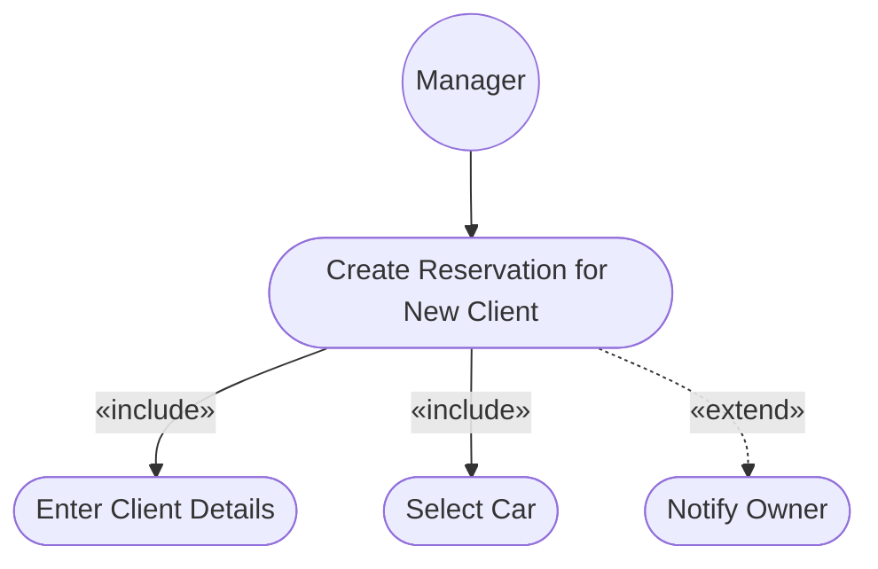

```mermaid
flowchart TD
    Manager((Manager))
    UC02([Create Reservation for New Client])
    UC03([Enter Client Details])
    UC04([Select Car])
    UC05([Notify Owner])

    Manager --> UC02
    UC02 -->|"«include»"| UC03
    UC02 -->|"«include»"| UC04
    UC02 -.->|"«extend»"| UC05
```

