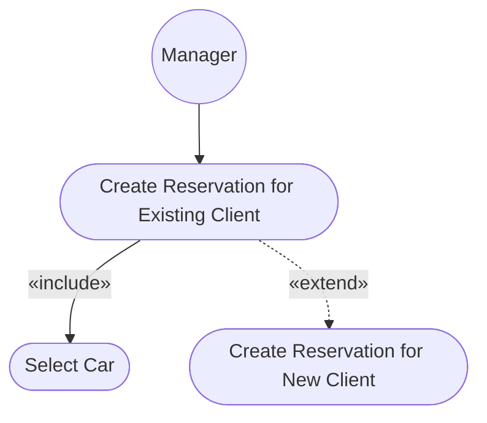

```mermaid
flowchart TD
    Manager((Manager))
    UC03([Create Reservation for Existing Client])
    UC04([Select Car])
    UC02([Create Reservation for New Client])

    Manager --> UC03
    UC03 -->|"«include»"| UC04
    UC03 -.->|"«extend»"| UC02
```
