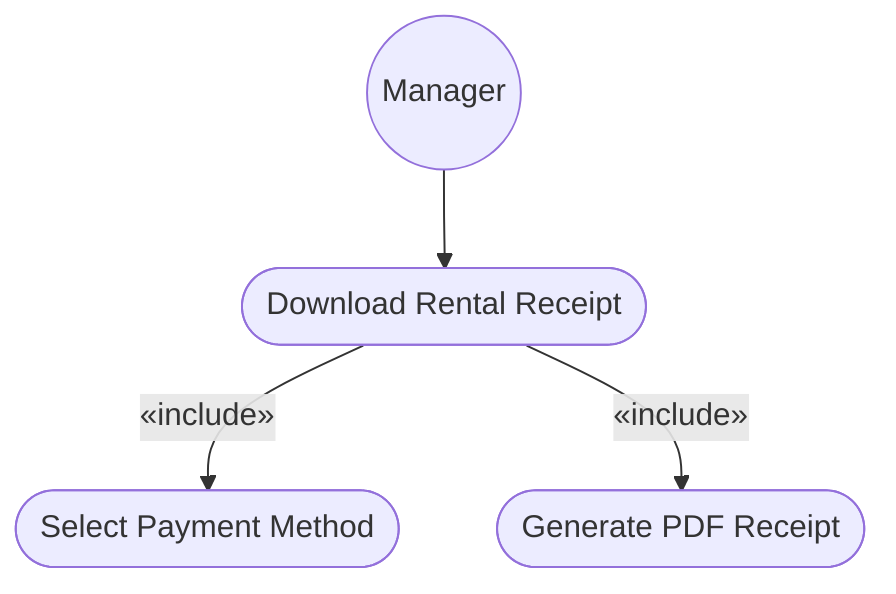

```mermaid
flowchart TD
    Manager((Manager))
    UC16([Download Rental Receipt])
    UC17([Select Payment Method])
    UC18([Generate PDF Receipt])

    Manager --> UC16
    UC16 -->|"«include»"| UC17
    UC16 -->|"«include»"| UC18
```
