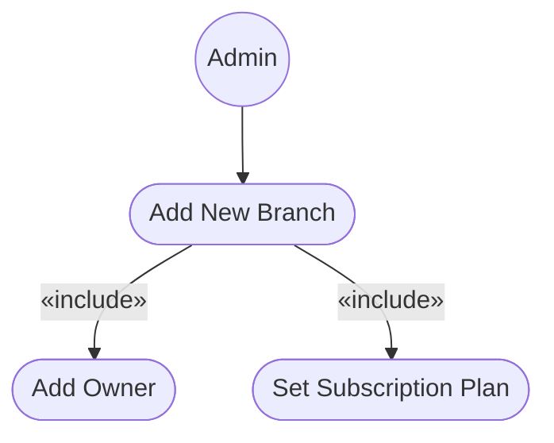

```mermaid
flowchart TD
    Admin((Admin))
    UC21([Add New Branch])
    UC22([Add Owner])
    UC23([Set Subscription Plan])

    Admin --> UC21
    UC21 -->|"«include»"| UC22
    UC21 -->|"«include»"| UC23
```
