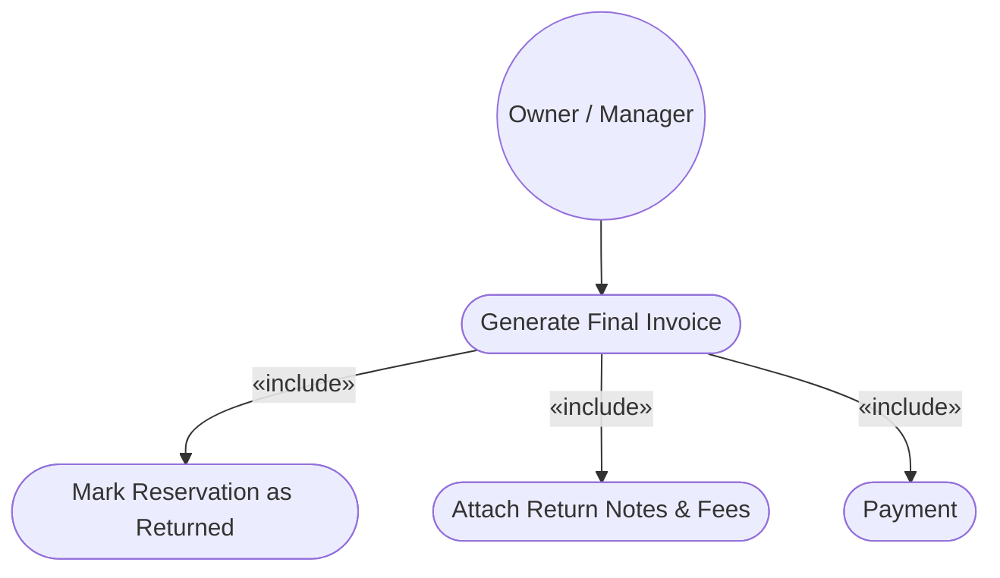

```mermaid
flowchart TD
    User((Owner / Manager))

    %% Use Cases
    UC24([Mark Reservation as Returned])
    UC31([Attach Return Notes & Fees])
    UC07([Payment])
    UC32([Generate Final Invoice])

    %% Actor
    User --> UC32

    %% Relationships
    UC32 -->|"«include»"| UC24
    UC32 -->|"«include»"| UC31
    UC32 -->|"«include»"| UC07
```

