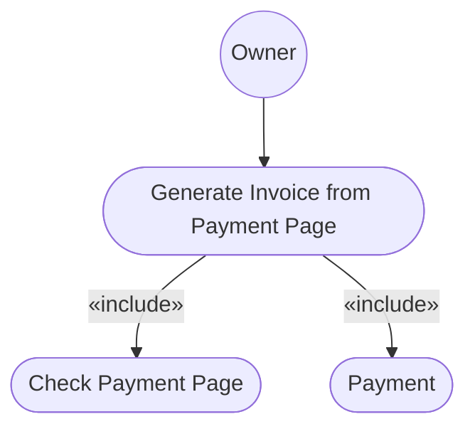

```mermaid
flowchart TD
    Owner((Owner))
    UC36([Generate Invoice from Payment Page])
    UC35([Check Payment Page])
    UC07([Payment])

    Owner --> UC36
    UC36 -->|"«include»"| UC35
    UC36 -->|"«include»"| UC07
```
