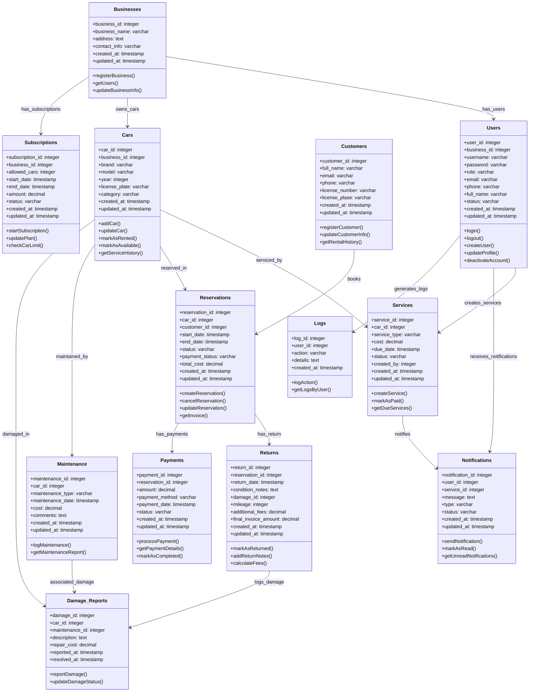

```mermaid  
classDiagram

%% === Users ===  
class Users {  
+user_id: integer  
+business_id: integer  
+username: varchar  
+password: varchar  
+role: varchar  
+email: varchar  
+phone: varchar  
+full_name: varchar  
+status: varchar  
+created_at: timestamp  
+updated_at: timestamp

+login()  
+logout()  
+createUser()  
+updateProfile()  
+deactivateAccount()  
}

%% === Businesses ===  
class Businesses {  
+business_id: integer  
+business_name: varchar  
+address: text  
+contact_info: varchar  
+created_at: timestamp  
+updated_at: timestamp

+registerBusiness()  
+getUsers()  
+updateBusinessInfo()  
}

%% === Cars ===  
class Cars {  
+car_id: integer  
+business_id: integer  
+brand: varchar  
+model: varchar  
+year: integer  
+license_plate: varchar  
+category: varchar  
+created_at: timestamp  
+updated_at: timestamp

+addCar()  
+updateCar()  
+markAsRented()  
+markAsAvailable()  
+getServiceHistory()  
}

%% === Services ===  
class Services {  
+service_id: integer  
+car_id: integer  
+service_type: varchar  
+cost: decimal  
+due_date: timestamp  
+status: varchar  
+created_by: integer  
+created_at: timestamp  
+updated_at: timestamp

+createService()  
+markAsPaid()  
+getDueServices()  
}

%% === Customers ===  
class Customers {  
+customer_id: integer  
+full_name: varchar  
+email: varchar  
+phone: varchar  
+license_number: varchar  
+license_plase: varchar  
+created_at: timestamp  
+updated_at: timestamp

+registerCustomer()  
+updateCustomerInfo()  
+getRentalHistory()  
}

%% === Reservations ===  
class Reservations {  
+reservation_id: integer  
+car_id: integer  
+customer_id: integer  
+start_date: timestamp  
+end_date: timestamp  
+status: varchar  
+payment_status: varchar  
+total_cost: decimal  
+created_at: timestamp  
+updated_at: timestamp

+createReservation()  
+cancelReservation()  
+updateReservation()  
+getInvoice()  
}

%% === Returns ===  
class Returns {  
+return_id: integer  
+reservation_id: integer  
+return_date: timestamp  
+condition_notes: text  
+damage_id: integer  
+mileage: integer  
+additional_fees: decimal  
+final_invoice_amount: decimal  
+created_at: timestamp  
+updated_at: timestamp

+markAsReturned()  
+addReturnNotes()  
+calculateFees()  
}

%% === Maintenance ===  
class Maintenance {  
+maintenance_id: integer  
+car_id: integer  
+maintenance_type: varchar  
+maintenance_date: timestamp  
+cost: decimal  
+comments: text  
+created_at: timestamp  
+updated_at: timestamp

+logMaintenance()  
+getMaintenanceReport()  
}

%% === Damage Reports ===  
class Damage_Reports {  
+damage_id: integer  
+car_id: integer  
+maintenance_id: integer  
+description: text  
+repair_cost: decimal  
+reported_at: timestamp  
+resolved_at: timestamp

+reportDamage()  
+updateDamageStatus()  
}

%% === Payments ===  
class Payments {  
+payment_id: integer  
+reservation_id: integer  
+amount: decimal  
+payment_method: varchar  
+payment_date: timestamp  
+status: varchar  
+created_at: timestamp  
+updated_at: timestamp

+processPayment()  
+getPaymentDetails()  
+markAsCompleted()  
}

%% === Notifications ===  
class Notifications {  
+notification_id: integer  
+user_id: integer  
+service_id: integer  
+message: text  
+type: varchar  
+status: varchar  
+created_at: timestamp  
+updated_at: timestamp

+sendNotification()  
+markAsRead()  
+getUnreadNotifications()  
}

%% === Logs ===  
class Logs {  
+log_id: integer  
+user_id: integer  
+action: varchar  
+details: text  
+created_at: timestamp

+logAction()  
+getLogsByUser()  
}

%% === Subscriptions ===  
class Subscriptions {  
+subscription_id: integer  
+business_id: integer  
+allowed_cars: integer  
+start_date: timestamp  
+end_date: timestamp  
+amount: decimal  
+status: varchar  
+created_at: timestamp  
+updated_at: timestamp

+startSubscription()  
+updatePlan()  
+checkCarLimit()  
}

%% === Relationships ===

Businesses --> Users : has_users  
Businesses --> Cars : owns_cars  
Businesses --> Subscriptions : has_subscriptions

Users --> Services : creates_services  
Users --> Notifications : receives_notifications  
Users --> Logs : generates_logs

Cars --> Services : serviced_by  
Cars --> Reservations : reserved_in  
Cars --> Maintenance : maintained_by  
Cars --> Damage_Reports : damaged_in

Customers --> Reservations : books

Reservations --> Returns : has_return  
Reservations --> Payments : has_payments

Returns --> Damage_Reports : logs_damage  
Maintenance --> Damage_Reports : associated_damage  
Services --> Notifications : notifies  
```

