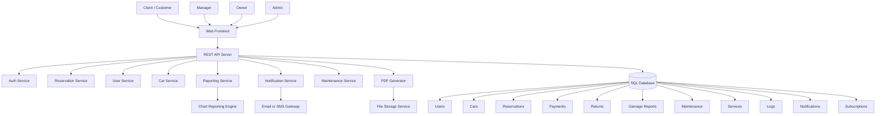

```mermaid  
graph TD

%% === External Users ===  
Client[Client / Customer]  
Manager[Manager]  
Owner[Owner]  
Admin[Admin]

%% === UI Layer ===  
UI[Web Frontend]

Client --> UI  
Manager --> UI  
Owner --> UI  
Admin --> UI

%% === Backend Layer ===  
UI --> API[REST API Server]

API --> AuthService[Auth Service]  
API --> ReservationService[Reservation Service]  
API --> UserService[User Service]  
API --> CarService[Car Service]  
API --> ReportingService[Reporting Service]  
API --> NotificationService[Notification Service]  
API --> MaintenanceService[Maintenance Service]  
API --> PDFService[PDF Generator]

%% === Database Layer ===  
API --> DB[(SQL Database)]

DB --> UsersTable[Users]  
DB --> CarsTable[Cars]  
DB --> ReservationsTable[Reservations]  
DB --> PaymentsTable[Payments]  
DB --> ReturnsTable[Returns]  
DB --> DamageReportsTable[Damage Reports]  
DB --> MaintenanceTable[Maintenance]  
DB --> ServicesTable[Services]  
DB --> LogsTable[Logs]  
DB --> NotificationsTable[Notifications]  
DB --> SubscriptionsTable[Subscriptions]

%% === External Services ===  
NotificationService --> EmailService[Email or SMS Gateway]  
PDFService --> FileStorage[File Storage Service]  
ReportingService --> ChartService[Chart Reporting Engine]  
```

