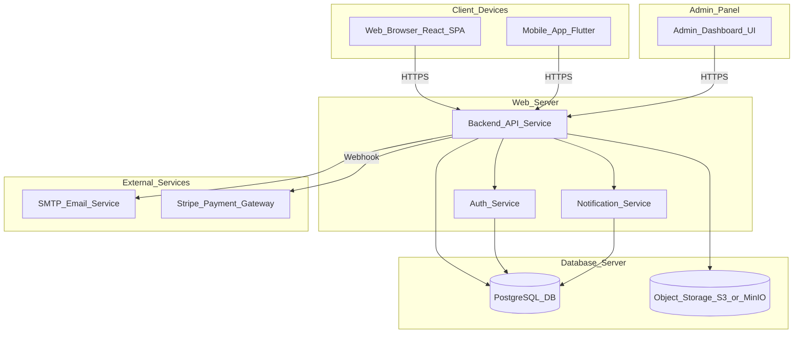

```mermaid
graph TD
    subgraph Client_Devices
        Browser[Web_Browser_React_SPA]
        MobileApp[Mobile_App_Flutter]
    end

    subgraph Web_Server
        API[Backend_API_Service]
        Auth[Auth_Service]
        Notification[Notification_Service]
    end

    subgraph Database_Server
        DB[(PostgreSQL_DB)]
        FileStore[(Object_Storage_S3_or_MinIO)]
    end

    subgraph Admin_Panel
        AdminUI[Admin_Dashboard_UI]
    end

    subgraph External_Services
        Email[SMTP_Email_Service]
        Payment[Stripe_Payment_Gateway]
    end

    Browser -->|HTTPS| API
    MobileApp -->|HTTPS| API
    AdminUI -->|HTTPS| API

    API --> DB
    API --> FileStore
    API --> Auth
    API --> Notification
    Auth --> DB
    Notification --> DB

    API -->|Webhook| Payment
    API --> Email
```
