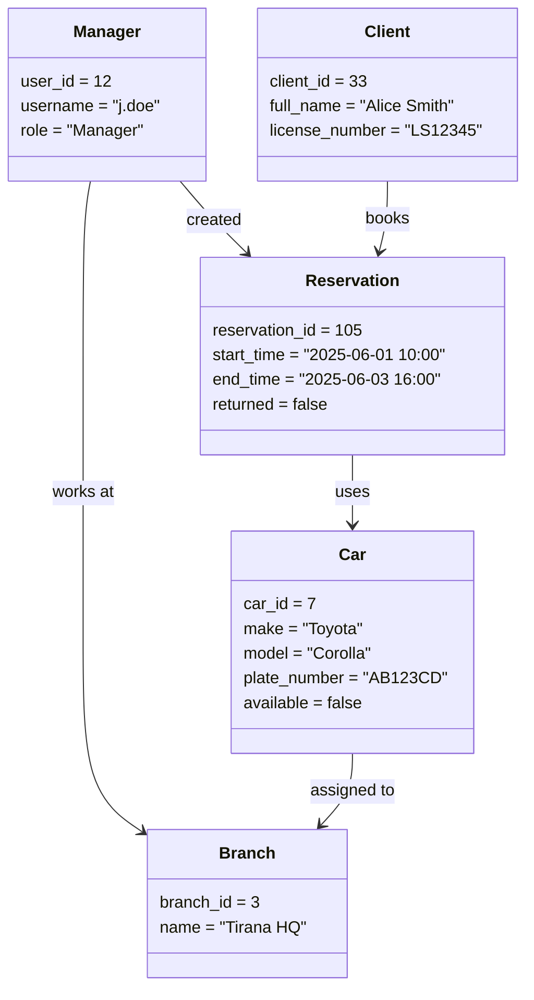

```mermaid
classDiagram
  class Manager {
    user_id = 12
    username = "j.doe"
    role = "Manager"
  }

  class Client {
    client_id = 33
    full_name = "Alice Smith"
    license_number = "LS12345"
  }

  class Car {
    car_id = 7
    make = "Toyota"
    model = "Corolla"
    plate_number = "AB123CD"
    available = false
  }

  class Reservation {
    reservation_id = 105
    start_time = "2025-06-01 10:00"
    end_time = "2025-06-03 16:00"
    returned = false
  }

  class Branch {
    branch_id = 3
    name = "Tirana HQ"
  }

  Manager --> Reservation : created
  Client --> Reservation : books
  Reservation --> Car : uses
  Manager --> Branch : works at
  Car --> Branch : assigned to
```
