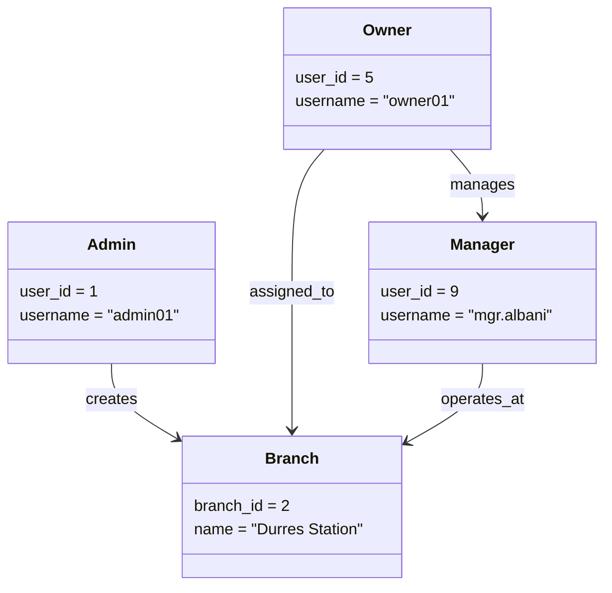

```mermaid
classDiagram
  class Admin {
    user_id = 1
    username = "admin01"
  }

  class Owner {
    user_id = 5
    username = "owner01"
  }

  class Manager {
    user_id = 9
    username = "mgr.albani"
  }

  class Branch {
    branch_id = 2
    name = "Durres Station"
  }

  Admin --> Branch : creates
  Owner --> Branch : assigned_to
  Owner --> Manager : manages
  Manager --> Branch : operates_at
```
