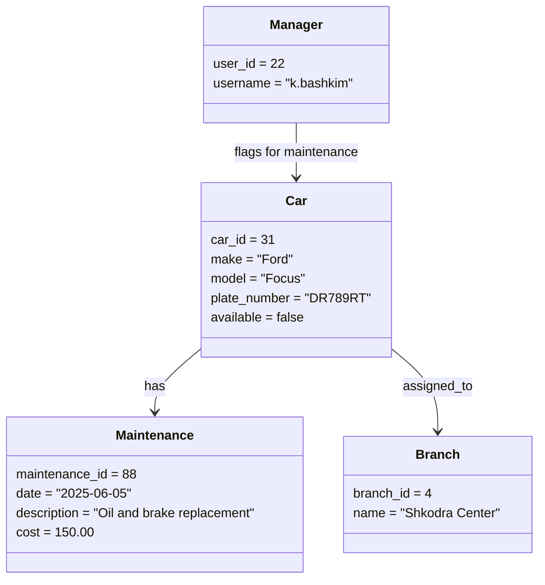

```mermaid
classDiagram
  class Manager {
    user_id = 22
    username = "k.bashkim"
  }

  class Car {
    car_id = 31
    make = "Ford"
    model = "Focus"
    plate_number = "DR789RT"
    available = false
  }

  class Maintenance {
    maintenance_id = 88
    date = "2025-06-05"
    description = "Oil and brake replacement"
    cost = 150.00
  }

  class Branch {
    branch_id = 4
    name = "Shkodra Center"
  }

  Manager --> Car : flags for maintenance
  Car --> Maintenance : has
  Car --> Branch : assigned_to
```
