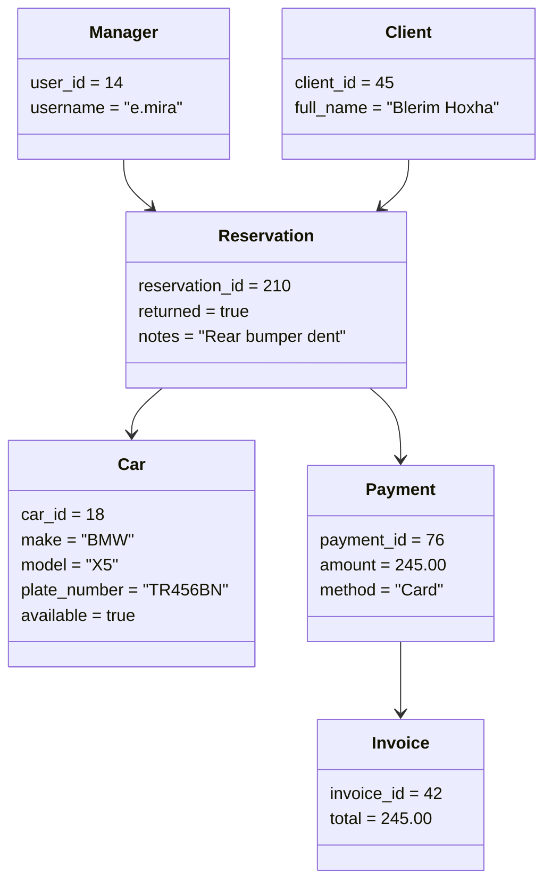

```mermaid
classDiagram
  class Manager {
    user_id = 14
    username = "e.mira"
  }

  class Client {
    client_id = 45
    full_name = "Blerim Hoxha"
  }

  class Car {
    car_id = 18
    make = "BMW"
    model = "X5"
    plate_number = "TR456BN"
    available = true
  }

  class Reservation {
    reservation_id = 210
    returned = true
    notes = "Rear bumper dent"
  }

  class Payment {
    payment_id = 76
    amount = 245.00
    method = "Card"
  }

  class Invoice {
    invoice_id = 42
    total = 245.00
  }

  Manager --> Reservation
  Client --> Reservation
  Reservation --> Car
  Reservation --> Payment
  Payment --> Invoice
```
